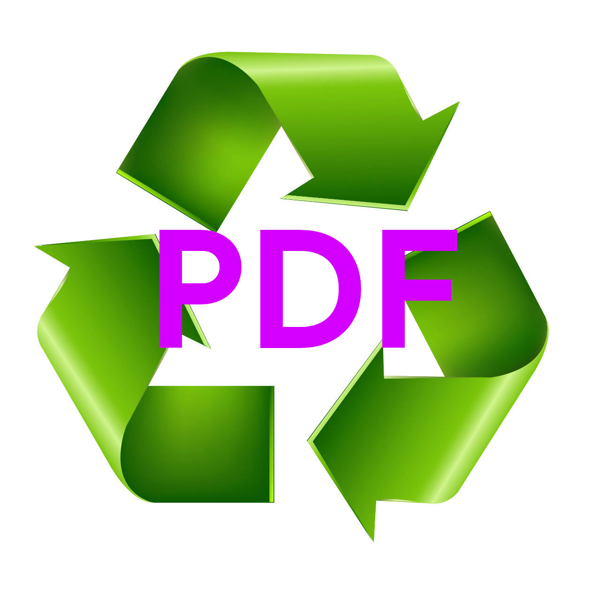

# Disconvertion

A Discord bot that automatically convert Libreoffice and MS Office documents into a PDF file

# How to use it ?

First you need to generate a bot token on the Discord developer page.

Then, you will need to create a `config.json` file at the root directory of this project which will containt your token. The following file should like this:

```json
{
    "token": "your token"
}
```